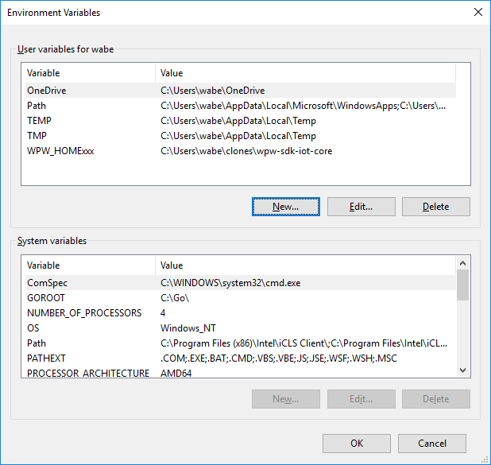
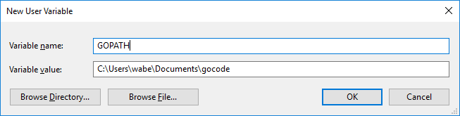

# HTML page

Installation instruction of the offline-server.

# Prerequisities:

Administration rights are required to setup the web server.

1. To speedup the setup: Verify (should be already done with god mode configuration) that the local router DHCP is setup to assign the IP address to 192.168.1.111 for the computer on which you are installing the god mode and offline-server.
2. Download and install GIT: https://git-scm.com/downloads
- Make sure that environment varaible %PATH% is updated, so git is accessible from cmd window.
3. Download and install GOLANG: https://golang.org/doc/install
4. Define the GOPATH environment variable.





5. Open new cmd window.

# Setup:

1. mkdir -p %GOPATH%\src\github.com\WPTechInnovation\
2. cd %GOPATH%\src\github.com\WPTechInnovation\
3. git clone https://github.com/WPTechInnovation/wpw-sdk-go.git
4. cd wpw-sdk-go\applications\offline-server
5. go get
6. go build

Additional Info:
- To run this server type: 
```
cd %GOPATH%\src\github.com\WPTechInnovation\wpw-sdk-go\applications\offline-server
offline-server.exe
```